# AIPM Commands Edition - プロダクト開発を「おまかせ」で進めるAIシステム

**「プロダクト開発って難しそう...」**  
**「アイデアはあるけど、何から始めればいいかわからない」**  
**「競合調査とか、ペルソナ作成とか、専門用語がいっぱいで...」**

そんな悩みを解決するのが、このAIプロダクト開発システムです。

## 🎯 これは何？

**AIPM Commands Edition**は、プロダクト開発の全工程を「AIと一緒に」進められるシステムです。

### 特徴

*   💬 **「/」を押すだけ**: 難しいことは覚えなくて大丈夫
*   🤖 **AIが質問してくれる**: 必要な情報を段階的に聞いてくれます
*   📋 **成果物が自動で作れる**: 競合調査からアプリ開発まで、プロの品質で
*   🔄 **「おまかせ」でOK**: 迷ったら「おまかせ」と言えば最適な提案をしてくれます

## 🌟 なぜこのシステムがすごいのか

### 従来の問題

*   😵 **専門用語だらけ**: 「プロダクトマネジメント」「ペルソナ」「MVP」...
*   😵 **何から始めるかわからない**: 手順がバラバラ、情報が散在
*   😵 **時間がかかる**: 調査だけで数週間、設計で数週間...
*   😵 **品質がバラバラ**: 経験がないと浅い分析になりがち

### このシステムの解決策

*   ✨ **専門知識不要**: AIが質問してくれるので、答えるだけ
*   ✨ **迷わない**: 「/」を押せば次にやることが見える
*   ✨ **圧倒的に速い**: 1日で企画から実装まで完成
*   ✨ **プロ品質**: 経験豊富なPMのノウハウをAIが再現

## 🎊 あなたのアイデアを形にしませんか？

**「いつかアプリを作ってみたい」**  
**「こんなサービスがあったらいいのに」**  
**「副業でプロダクト開発してみたい」**

そんな想いを、今日から現実にできます。

### 今すぐ始める理由

*   🚀 **AI技術の進歩**: 今が最も簡単にプロダクト開発できる時代
*   💡 **アイデアの価値**: あなたの「困った」は他の人も困っている
*   ⏰ **時間効率**: 従来の1/10の時間で形にできる
*   🎯 **学習効果**: 実際に作ることで、プロダクト開発が身につく
 


## 🚀 今すぐ始める4ステップ

### 1\. Cursorの準備（5分）

1.  [Cursor](https://cursor.sh/)をダウンロード・インストール
2.  Cursorを起動

### 2\. AIPMシステムの導入（3分）

#### 既存プロジェクトに追加する場合
```bash
# あなたのプロジェクトフォルダで実行
cd /path/to/your/project

# .cursor/commands フォルダを作成（なければ）
mkdir -p .cursor/commands

# AIPMシステムをクローン
git clone https://github.com/your-repo/aipm-commands .cursor/commands/aipm
```

#### 新しいプロジェクトとして始める場合
```bash
# 新しいフォルダを作成
mkdir my-awesome-project
cd my-awesome-project

# .cursor/commands フォルダを作成
mkdir -p .cursor/commands

# AIPMシステムをクローン
git clone https://github.com/your-repo/aipm-commands .cursor/commands/aipm
```

#### 📁 正しい配置構造
```
your-project/
├── .cursor/
│   └── commands/
│       └── aipm/           ← ここに配置
│           ├── README.md
│           ├── 0_initialize/
│           ├── 1_sense/
│           ├── 2_focus/
│           ├── 3_discovery/
│           ├── 4_delivery/
│           └── 9_hackathon/  ← ハッカソン用コマンド
├── Flow/                   ← 作業ファイルが作られる
├── Stock/                  ← 完成品が保存される
└── （あなたのプロジェクトファイル）
```

### 3\. 動作確認（1分）

1.  Cursorでプロジェクトフォルダを開く
2.  チャット欄で「**/**」を押す
3.  `aipm` で始まるコマンドが表示されればOK！


### ⚠️ トラブルシューティング

#### コマンドが表示されない場合
1.  `.cursor/commands/aipm/` フォルダが正しく配置されているか確認
2.  Cursorを再起動
3.  プロジェクトフォルダを再度開く

#### 権限エラーが出る場合
```bash
# フォルダの権限を確認・修正
chmod -R 755 .cursor/commands/aipm
```


**通常なら数週間かかる作業が、たった1日で完成！**

## 🏃 （例１）簡単コース：ハッカソン向け超高速開発（3時間でMVP完成）

**時間がない？大丈夫！** 市場調査をスキップして、いきなり開発に集中できます。

### 🌟 実際のハッカソン事例：共働きママ向けTODOアプリ「SmartTodo」 


#### **朝10:02 - プロジェクト開始&ペルソナ作成（15分）**
```
ユーザー: /aipm/0_initialize/00_プロジェクト開始

AI: ✅ プロジェクト初期化完了！
    📁 作業フォルダ作成
    📋 プロジェクト憲章作成  
    ⚙️ 設定ファイル準備


ユーザー: /aipm/3_discovery/01_ペルソナ作成

AI: ペルソナ情報を教えてください

ユーザー: 忙しい共働きママ（保育園送迎あり）
        35歳・女性・事務職（在宅と出社のハイブリッド）
        家事と仕事のタスクが混在し、優先度判断に時間がかかる

AI: ✅ さくらさん（35歳女性・共働きママ）のペルソナ完成！
    🎯 核心的な悩み: 「隙間時間で何から手をつけるか迷って動けない」
```

#### **朝10:20 - 課題定義（20分）**
```
ユーザー: /aipm/3_discovery/02_課題定義

AI: ✅ 課題定義完了！
    🎯 特定された3つの主要課題:
    - PR1: 朝の限られた時間で何から手をつけるか瞬時に判断できない
    - PR2: 仕事と家事のタスクが混在し、優先度判断に迷う  
    - PR3: 隙間時間で何ができるか分からず、効率的に時間を使えない
    
    💔 根本問題: 自己肯定感の低下（家事が残る→家が荒れる→罪悪感→家族ストレス）
```

#### **朝10:45 - ソリューションマップ（25分）**
```
ユーザー: /aipm/3_discovery/03_ソリューションマップ

AI: ✅ ソリューションマップ完了！
    🎯 3つのMVPソリューション:
    - SL2: コンテキスト分離タスク管理（MVP最優先）
    - SL1: 朝のルーティン自動提案機能  
    - SL3: 隙間時間マッチング機能
    
    💡 ソリューション仮説:
    「コンテキスト分離とインテリジェント提案機能を提供することで、
     より多くの共働きママが判断疲れから解放され、限られた時間を効率的に活用できる」
```

#### **昼11:15 - ストーリーマップ（30分）**
```
ユーザー: /aipm/3_discovery/04_ストーリーマップ

AI: ✅ ストーリーマップ完了！
    🎯 3つのユーザーストーリー:
    - ST2: 仕事・家事モード切り替え（MVP最優先）
    - ST1: 朝の優先タスク1つ表示（MVP次優先）
    - ST3: 隙間時間別タスク提案（Release1）
    
    🚀 MVP開発計画:
    - Phase 1: ST2実装（コンテキスト分離）- 2-3週間
    - Phase 2: ST1統合（優先タスク表示）- 1-2週間
```

#### **昼12:00 - 開発タスク分解（20分）**
```
ユーザー: /aipm/4_delivery/07_開発タスク分解

AI: ✅ 開発タスク分解完了！
    🔧 10個のタスク（HTML/CSS/JS構成）:
    - Common: T_COMMON_ENV, T_COMMON_STORAGE
    - ST1: T_ST1_VIEW, T_ST1_PRIORITY  
    - ST2: T_ST2_MODE, T_ST2_FILTER
    - ST3: T_ST3_TIME_MATCH, T_ST3_PROGRESS
    - NFR: T_NFR_ACCESSIBILITY, T_NFR_PERF
```

#### **午後12:30-15:00 - 実装・検証（2時間30分）**
```
ユーザー: /aipm/4_delivery/08_チケット開始
ユーザー: /aipm/4_delivery/09_チケット実行と検証

AI: T_COMMON_ENV から順次実装
    ✅ index.html（基本HTML構造）
    ✅ styles.css（モード切替UI、プログレス表示）
    ✅ app.js（タスク管理、モード切替、時間マッチング、達成感演出）
    
    実装した機能:
    - 🔄 仕事・家事モード切り替え（1秒以内）
    - 📋 「今やる1つ」の自動表示・更新
    - ⏰ 隙間時間マッチング（5分・10分・30分対応）
    - 🏆 達成感可視化（進捗率・バッジ表示）
    - 💾 データ永続化（localStorage）

ユーザー: MVPとしては十分です

AI: ✅ MVP完了！進捗率100%
```

#### **午後15:30 - 提出・発表準備（30分）**
```
ユーザー: /aipm/9_hackathon/Marpスライド生成

AI: ✅ プレゼンスライド完成！
    📁 slides_mvp.marp.md - 13枚のストーリー性あるスライド

ユーザー: /aipm/9_hackathon/成果物パッケージング

AI: ✅ 提出パッケージ作成完了！
    📁 全成果物を整理・パッケージング

ユーザー: /aipm/9_hackathon/GitHub提出

AI: ✅ GitHub提出完了！
    🔗 個別リポジトリ: SmartTodo-Mama-submit_2025-09-09
    🔗 共有リポジトリPR: https://github.com/livyn-inc/aipm-hackathon-share/pull/3
```

### 🏆 ハッカソン成果：3時間でフル機能MVP完成

**SmartTodo** - 共働きママ向けコンテキスト分離型TODOアプリ

#### 🎯 実装した核心機能
- **仕事・家事モード切り替え**: 認知負荷の完全軽減
- **「今やる1つ」表示**: 朝の判断時間3-5分→30秒に短縮
- **隙間時間マッチング**: 5分・10分・30分に応じたタスク提案
- **達成感演出**: 進捗可視化・バッジシステムで継続モチベーション

## 🚀 （例２）フルコース：PdM向けタスク管理ツール「CrossPM」開発


### 🌅 朝：「仕事のタスク管理、もっと楽にならないかな...」

**miyatti777さん**（プロダクトマネージャー）の一言から始まりました。

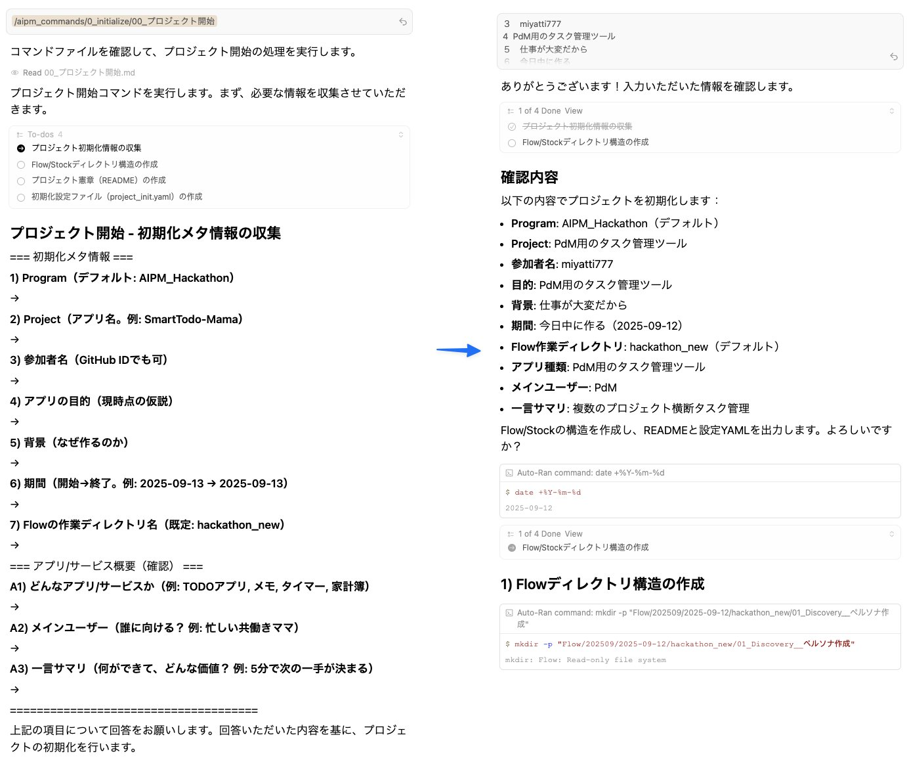

```
miyatti: /aipm/0_initialize/00_プロジェクト開始
miyatti: PdM用のタスク管理ツール、仕事が大変だから、今日中に作る、おまかせ

AI: ✅ プロジェクト初期化完了！
    📁 作業フォルダ作成
    📋 プロジェクト憲章作成  
    ⚙️ 設定ファイル準備
```

**3分で開発環境準備完了**

### 🔍 午前：「どんな競合がいるんだろう？」

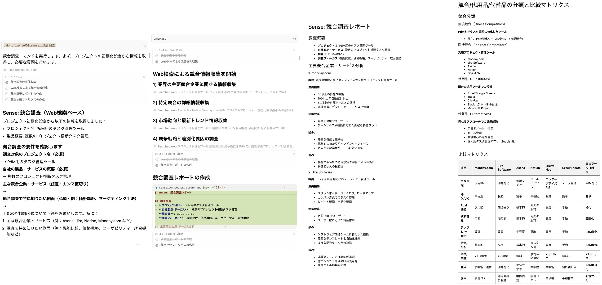

```
miyatti: /aipm/1_sense/01_競合調査
AI: 競合調査を実施します。どんな競合を調べたいですか？
miyatti: おまかせ

AI: ✅ 主要5社の詳細分析完了！
    📊 Asana（多機能だが学習コスト高）
    📊 Jira（開発者向けでPdMには複雑）  
    📊 Notion（カスタマイズ性高いが複雑）
    💡 PdM特化ツールは少ない → ブルーオーシャン発見！
```

```
miyatti: /aipm/1_sense/02_顧客調査
miyatti: おまかせ

AI: ✅ PdMの核心的課題を発見！
    😤 複数プロジェクト横断管理の困難
    😤 チームコミュニケーションの非効率  
    😤 ツール選定の悩み（多機能すぎて使いこなせない）
    💡 月額1,500円程度が適正価格
```

**15分で市場の全体像が見えた**


### 🛠️ 午前中続き：「インタビューでもっと深く知りたい」

#### **朝10:15 - 個別インタビュー分析（田中さん）**

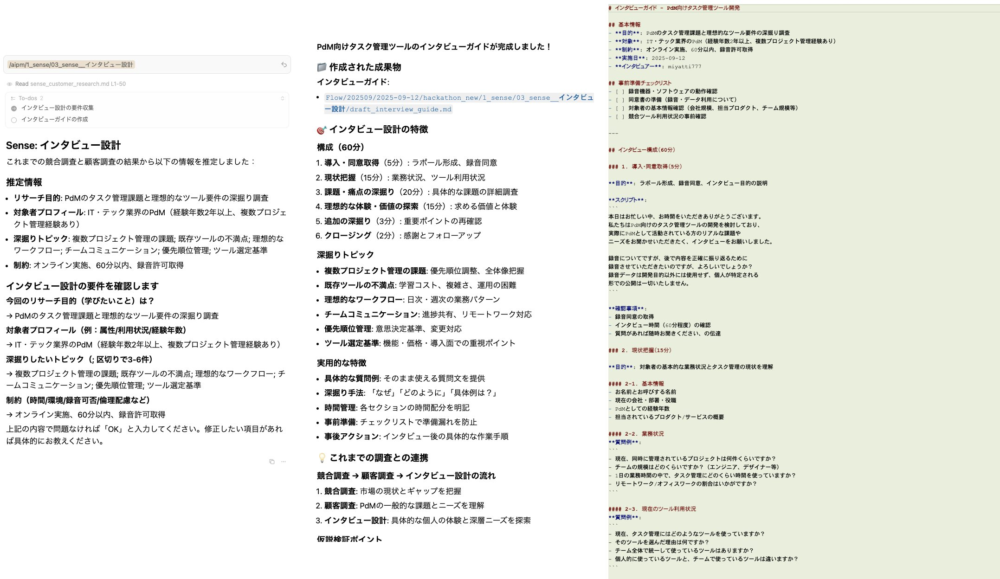

```
miyatti: /aipm/1_sense/05_sense__インタビュー分析（個別）

AI: 仮想インタビューログから田中さんの情報を推定しました：
    - 参加者ID/イニシャル: 田中さん
    - 実施日: 2025-09-12
    - 概要: スタートアップPdM（経験3.5年）、複数プロジェクト管理の課題、Jiraの使いにくさ、自動化への期待、月額2,000円以内の価格感度

miyatti: onegaisimasu

AI: ✅ 個別分析レポート完成！
    📁 draft_interview_analysis_田中さん.md
    
    🎯 核心的課題（優先度高）:
    1. 複数プロジェクト横断管理: 全体俯瞰の困難
    2. 既存ツールの使いにくさ: Jiraの複雑さ
    3. 管理作業の時間負担: 週1時間の進捗レポート作成
    4. 情報共有の分断: リモートワークでの課題
    
    💰 ビジネス指標:
    - 価格上限: 月額2,000円以内
    - 時間節約: 週1時間の管理作業削減
    - ROI期待: 具体的な効果測定が導入の決め手
```

#### **朝10:20 - 追加仮想インタビュー生成**

```
miyatti: /aipm/1_sense/90_sense__仮想インタビューログ生成 他のパターン

AI: 異なる視点（賛同/中立/否定/想定外）のパターンを生成します。

miyatti: 後２件作って

AI: ✅ 追加パターン完成！
    📁 virtual_interview_logs_additional.md
    
    🎭 生成されたパターン:
    - セッション2: 佐藤さん（大企業PdM - 否定的視点）
    - セッション3: 山田さん（スタートアップPdM - 想定外視点）
    
    🚫 否定的視点から見えた課題:
    1. 大企業の導入障壁: セキュリティ監査に半年
    2. 予算形態の制約: 年次予算での管理、従量課金は困難
    3. 現状満足度の高さ: 体系化されたプロセス、PMOによる標準化
    
    🔧 想定外視点から見えた技術ニーズ:
    1. プログラマビリティの重要性: APIファーストの設計
    2. カスタマイズ性への要求: 自作ダッシュボード
    3. オープンソースへの期待: コードの透明性、セルフホスティング
```

#### **朝10:25 - 個別インタビュー分析（佐藤さん）**

```
miyatti: /aipm/1_sense/05_sense__インタビュー分析（個別）

AI: 追加の仮想インタビューログから佐藤さんの情報を推定しました：
    - 参加者ID/イニシャル: 佐藤さん
    - 実施日: 2025-09-12
    - 概要: 大企業PdM（従業員3,000名、経験5年）、現状満足度高く新ツール導入に否定的、セキュリティ要件・ROI・年次予算制約を重視

miyatti: onegai

AI: ✅ 佐藤さん個別分析完了！
    📁 draft_interview_analysis_佐藤さん.md
    
    🎯 否定的視点からの重要な洞察:
    - 現状満足度の高さ: 体系化されたプロセスへの満足
    - 変更リスクへの懸念: 新ツール導入による混乱への恐れ
    - 厳格な意思決定基準: ROI・セキュリティ・予算制約
    
    🔄 田中さんとの比較分析:
    | 項目 | 田中さん（中規模） | 佐藤さん（大企業） |
    | 現状満足度 | 不満（改善求む） | 満足（現状維持） |
    | 変化への姿勢 | 積極的 | 消極的・慎重 |
    | 価格感度 | 月額2,000円以内 | 年次ライセンス |
```

#### **朝10:30 - リサーチサマリー（全体統合）**

```
miyatti: /aipm/1_sense/06_sense__リサーチサマリー（全体）

AI: これまでに作成した調査・分析ファイルから以下のソースを推定しました：
    - 競合調査: sense_competitor_research.md
    - 顧客調査: sense_customer_research.md
    - 個別分析（田中さん）: draft_interview_analysis_田中さん.md
    - 個別分析（佐藤さん）: draft_interview_analysis_佐藤さん.md
    - インタビューインサイト: interview_insights_analysis.md

miyatti: onegai

AI: ✅ リサーチサマリー（全体）完了！
    📁 draft_research_summary.md
    
    🎯 確定した市場機会:
    1. PdM特化ツールの不在: 明確な市場ギャップの存在
    2. 複数プロジェクト横断管理: 最重要かつ未解決の課題
    3. 中価格帯の空白: 月額990円〜5,500円の間に機会
    4. 中規模企業の積極性: メインターゲットとして最適
    
    📊 明確な市場セグメント:
    | セグメント | 特徴 | 優先度 | アプローチ |
    | 中規模企業 | 積極的、課題明確 | 第1優先 | 使いやすさ重視 |
    | スタートアップ | 技術重視、ニッチ | 第2優先 | API・カスタマイズ |
    | 大企業 | 慎重、制約多い | 第3優先 | ROI・セキュリティ |
```

#### **朝10:40 - オポチュニティ仮説抽出**

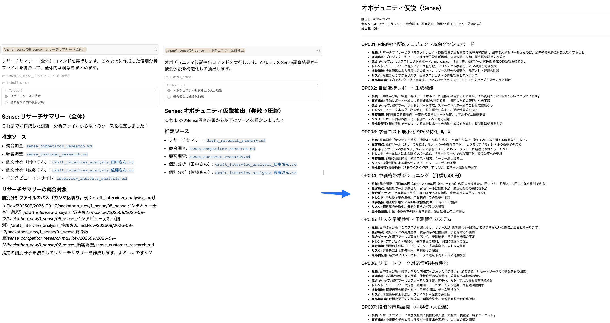

```
miyatti: /aipm/1_sense/07_sense__オポチュニティ仮説抽出

AI: これまでのSense調査結果から以下のソースを推定しました：
    - リサーチサマリー: draft_research_summary.md
    - 競合調査: sense_competitor_research.md
    - 顧客調査: sense_customer_research.md
    - 個別分析（田中さん）: draft_interview_analysis_田中さん.md
    - 個別分析（佐藤さん）: draft_interview_analysis_佐藤さん.md

miyatti: omakase

AI: ✅ オポチュニティ仮説抽出完了！
    📁 sense_opportunities.yaml - 構造化された機会仮説リスト
    📁 sense_opportunities.md - 人間可読版
    
    💎 抽出された主要機会（10件）:
    - OP001: PdM特化複数プロジェクト統合ダッシュボード
    - OP002: 自動進捗レポート生成・通知システム
    - OP003: 学習コスト最小化UI/UX設計
    - OP004: PdMコミュニティ連携・知見共有プラットフォーム
    - OP005: AI駆動優先順位提案エンジン
```

### 🎯 Focus フェーズ：「何を作るか決めよう」

#### **朝10:50 - プロダクト定義**

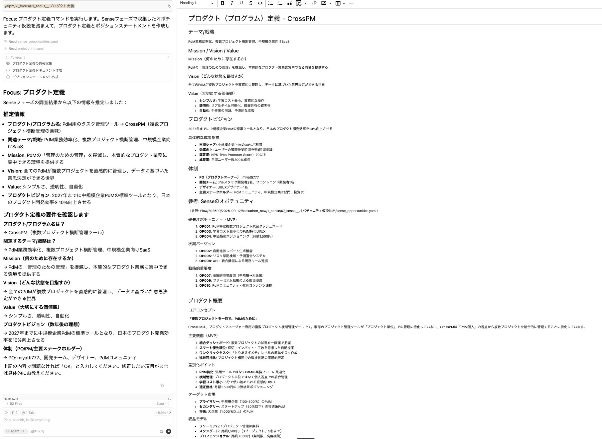

```
miyatti: /aipm/2_focus/01_focus__プロダクト定義

AI: Senseフェーズの調査結果から以下の情報を推定しました：
    - プロダクト/プログラム名: PdM用のタスク管理ツール → CrossPM（複数プロジェクト横断管理の意味）
    - Mission: PdMの「管理のための管理」を撲滅し、本質的なプロダクト業務に集中できる環境を提供する
    - Vision: 全てのPdMが複数プロジェクトを直感的に管理し、データに基づいた意思決定ができる世界
    - Value: シンプルさ、透明性、自動化
    - プロダクトビジョン: 2027年までに中規模企業PdMの標準ツールとなり、日本のプロダクト開発効率を10%向上させる

miyatti: おまかせ

AI: ✅ Focus: プロダクト定義完了！
    📁 focus_product_definition.md - プロダクト（プログラム）定義
    📁 focus_positioning_statement.md - ポジションステートメント
```

#### **朝11:00 - 市場規模推定**

```
miyatti: /aipm/2_focus/02_focus__市場規模推定

AI: プロダクト定義から以下の情報を推定しました：
    - プロジェクト名: CrossPM
    - 対象地域: 日本
    - 企業規模閾値: 従業員100-500名（中規模企業）
    - 企業数: 約15,000社（推定）
    - 初期席数/社: 3席（PdM + 関連職種）
    - 席課金（月額）: 1,500円
    - プラットフォーム年額: 500,000円（中規模企業向け）

miyatti: おまかせ

AI: ✅ Focus: 市場規模推定完了！
    📁 focus_market_size_estimation.md - TAM/SAM/SOM計算
    📁 gsheets/ - Google Sheets用CSV・手順
    📁 assumptions_validation.md - 仮置き数値の妥当性検証メモ
    
    📈 市場規模算出結果:
    - TAM（ウェッジ）: 約27億円
    - TAM（拡張例）: 約180億円  
    - SAM（40%）: 約11億円
    - SOM（保守/標準/強気）: 0.9億円/2.5億円/5.4億円
```

#### **朝11:10 - ラフロードマップ作成**

```
miyatti: /aipm/2_focus/03_focus__ラフロードマップ作成

AI: プロダクト定義と市場規模推定から以下の情報を推定しました：
    期間: 2025年Q4〜2026年Q3（12ヶ月）
    フェーズ構成: MVP（基本機能開発・検証）→ Pilot（限定顧客実証）→ GA（一般提供・拡大）
    主要マイルストーン:
    - MVP完成（2025年12月）: 統合ダッシュボード、基本タスク管理
    - Pilot開始（2026年1月）: 50社での実証実験
    - GA開始（2026年4月）: フリーミアム提供開始
    - 100ユーザー達成（2026年6月）: 短期目標達成
    - 1,000ユーザー達成（2026年9月）: 中期目標達成

miyatti: OK

AI: ✅ Focus: ラフロードマップ作成完了！
    📁 focus_rough_roadmap.md - 四半期/週粒度のロードマップ
    📊 Mermaidガントチャート付き
```

#### **朝11:15 - OKR作成**

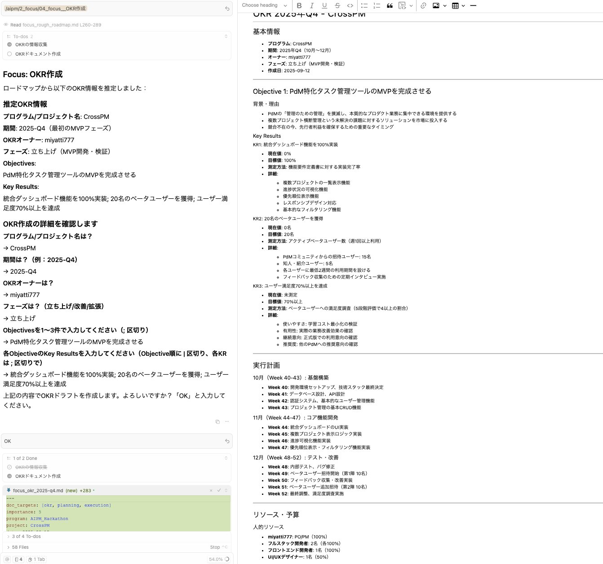

```
miyatti: /aipm/2_focus/04_focus__OKR作成

AI: ロードマップから以下のOKR情報を推定しました：
    - プログラム/プロジェクト名: CrossPM
    - 期間: 2025-Q4（最初のMVPフェーズ）
    - OKRオーナー: miyatti777
    - Objectives: PdM特化タスク管理ツールのMVPを完成させる
    - Key Results: 統合ダッシュボード機能を100%実装; 20名のベータユーザーを獲得; ユーザー満足度70%以上を達成

miyatti: OK

AI: ✅ Focus: OKR作成完了！
    📁 focus_okr_2025-q4.md - 2025-Q4のOKR定義
```

#### **朝11:20 - リーンキャンバス作成**

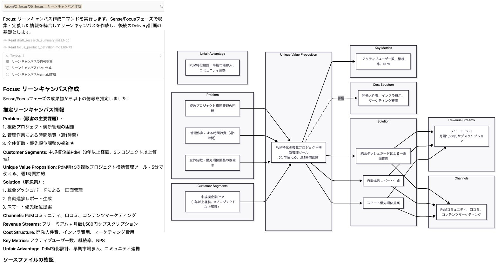

```
miyatti: /aipm/2_focus/05_focus__リーンキャンバス作成

AI: Sense/Focusフェーズの成果物から以下の情報を推定しました：
    Problem（顧客の主要課題）:
    1. 複数プロジェクト横断管理の困難
    2. 管理作業による時間浪費（週1時間）
    3. 全体俯瞰・優先順位調整の複雑さ
    
    Customer Segments: 中規模企業PdM（3年以上経験、3プロジェクト以上管理）
    Unique Value Proposition: PdM特化の複数プロジェクト横断管理ツール - 5分で使える、週1時間節約

miyatti: OK

AI: ✅ リーンキャンバス作成完了！
    📁 focus_lean_canvas.yaml - 構造化されたリーンキャンバスデータ
    📁 focus_lean_canvas_mermaid.md - 視覚的なMermaid図表と詳細解説
    
    🎯 CrossPM リーンキャンバス サマリー:
    核心価値: PdM特化の複数プロジェクト横断管理ツール - 5分で使える、週1時間節約
    収益モデル: フリーミアム + 月額1,500円サブスクリプション
```

### 🔬 Discovery フェーズ：「具体的にどう作るか設計しよう」

#### **昼12:00 - ペルソナ作成**


```
miyatti: /aipm/3_discovery/01_Discovery__ペルソナ作成

AI: Senseフェーズの成果物から以下の情報を分析しました：
    推定ペルソナ候補: 中規模企業PdM（田中さんタイプ）
    年齢・性別・職業: 30代前半男性、PdM経験3-5年、中規模企業勤務
    1日の流れ: 朝一番15分タスク確認 → 昼休み後10分進捗チェック → 夕方15分翌日準備 → 週次1時間レポート作成
    アプリに関する悩み: 複数プロジェクト横断管理の困難、全体俯瞰の困難、優先順位調整の複雑さ
    価値観: 効率性、透明性、データに基づく意思決定

miyatti: OK

AI: ✅ 仮説駆動ペルソナ作成完了！
    📁 persona_crosspm.md - 詳細なペルソナ仮説ドキュメント
    📁 experience_map.yaml - 構造化された体験マップデータ
    📁 experience_map_mermaid.md - 視覚的な体験フロー図表
    
    👤 田中健太（32歳男性PdM）:
    - 企業: 中規模IT企業（従業員250名）
    - 経験: PdM経験4年、前職エンジニア
    - 管理対象: 3つのプロジェクト同時管理
    - 核心的な悩み: 「複数プロジェクトの全体像が見えず、優先順位判断に迷い、管理作業に時間を取られて本質業務に集中できない」
```

#### **昼12:10 - 課題定義**

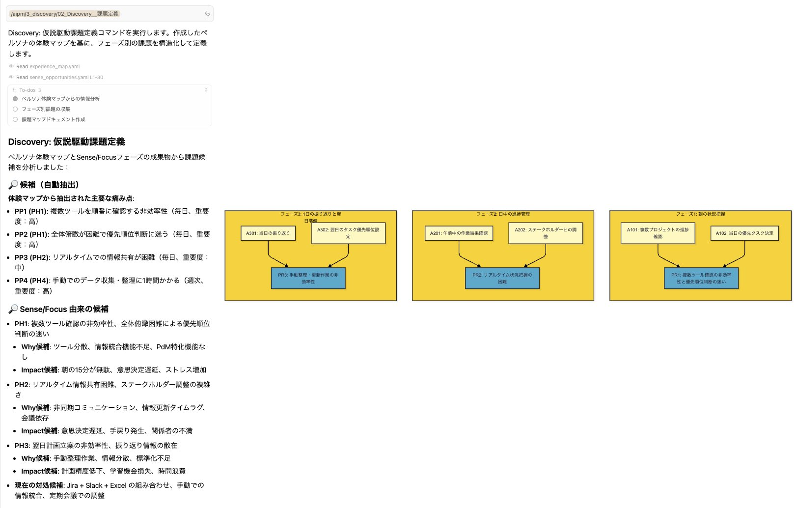

```
miyatti: /aipm/3_discovery/02_Discovery__課題定義

AI: ペルソナ体験マップとSense/Focusフェーズの成果物から課題候補を分析しました：
    PH1（朝の状況把握）の課題候補:
    - PP1: 複数ツールを順番に確認する非効率性（Jira、Slack、メール）
    - PP2: 全体俯瞰が困難で優先順位判断に迷う
    
    PH2（日中の進捗管理）の課題候補:
    - PP3: リアルタイムでの情報共有が困難（ステークホルダーとの調整）
    
    PH4（週次レポート作成）の課題候補:
    - PP4: 手動でのデータ収集・整理に1時間かかる

miyatti: OK

AI: ✅ 課題定義完了！
    📁 customer_problem_map.yaml - ペルソナの体験フェーズと課題の詳細マッピング
    📁 problem_statement.md - 課題定義書（定量的インパクト分析含む）
    
    🎯 特定された3つの主要課題:
    - PR1: 複数ツール確認の非効率性と優先順位判断の迷い (高優先度)
    - PR2: リアルタイム状況把握の困難 (中優先度)
    - PR3: 手動整理・更新作業の非効率性 (高優先度)
    
    📊 定量的インパクト:
    - 合計時間浪費: 45分/日 = 年間180時間（22.5営業日相当）
    - CrossPMによる解決: PdM1人あたり年間180時間の時間節約が期待
```

#### **昼12:20 - ソリューションマップ**

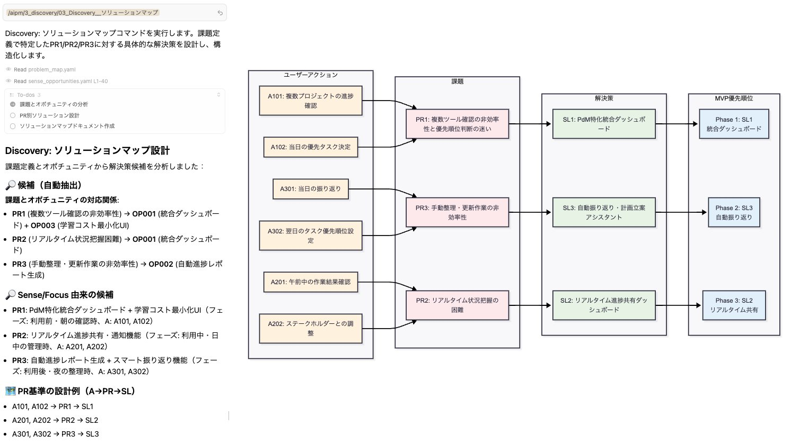

```
miyatti: /aipm/3_discovery/03_Discovery__ソリューションマップ

AI: 課題定義とオポチュニティから解決策候補を分析しました：
    課題とオポチュニティの対応関係:
    - PR1 (複数ツール確認の非効率性) → OP001 (統合ダッシュボード) + OP003 (学習コスト最小化UI)
    - PR2 (リアルタイム状況把握困難) → OP001 (統合ダッシュボード)
    - PR3 (手動整理・更新作業の非効率性) → OP002 (自動進捗レポート生成)

miyatti: OK

AI: ✅ ソリューションマップ完了！
    📁 solution_map.yaml - 構造化されたソリューションマップデータ
    📁 solution_statement.md - ソリューション仮説書（定量的効果分析含む）
    📁 mvp_feature_breakdown.md - MVP機能詳細・開発計画・コスト見積もり
    
    🎯 設計された3つのソリューション:
    - SL1: PdM特化統合ダッシュボード (MVP Phase 1 - 最優先)
    - SL3: 自動振り返り・計画立案アシスタント (Phase 2)
    - SL2: リアルタイム進捗共有ダッシュボード (Phase 3)
    
    🔬 ソリューション仮説:
    「PdM特化の統合ダッシュボードと自動化機能を提供することで、より多くのPdMが複数プロジェクトを効率的に管理し、本質的なプロダクト業務に集中できるようになる」
```

#### **昼12:30 - ストーリーマップ**

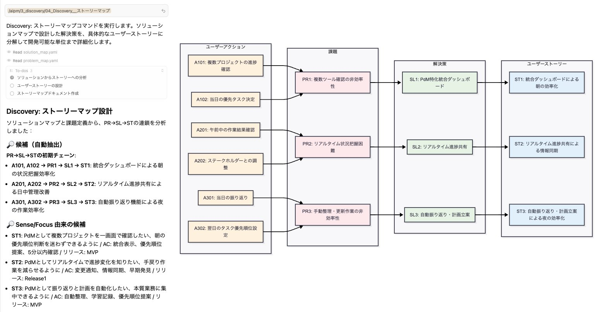

```
miyatti: /aipm/3_discovery/04_Discovery__ストーリーマップ

AI: ソリューションマップと課題定義から、PR→SL→STの連鎖を分析しました：
    PR→SL→STの初期チェーン:
    - A101, A102 → PR1 → SL1 → ST1: 統合ダッシュボードによる朝の状況把握効率化
    - A201, A202 → PR2 → SL2 → ST2: リアルタイム進捗共有による日中管理改善
    - A301, A302 → PR3 → SL3 → ST3: 自動振り返り機能による夜の作業効率化

miyatti: OK

AI: ✅ ストーリーマップ完了！
    📁 story_map.yaml - 構造化されたストーリーマップデータ（工数見積もり・リスク評価含む）
    📁 story_map_mermaid.md - A→PR→SL→STフローの視覚化図とガントチャート
    📁 mvp_story_breakdown.md - MVPストーリーの詳細とスプリント計画
    📁 development_ready_stories.md - 開発準備完了ストーリー（技術実装方針・DoD含む）
    
    🎯 設計された3つのユーザーストーリー:
    - ST1: 統合ダッシュボードによる朝の効率化 (MVP Priority 1) - 8 Story Points
    - ST3: 自動振り返り・計画立案による夜の効率化 (MVP Priority 2) - 5 Story Points  
    - ST2: リアルタイム進捗共有による情報同期 (Release1 Priority 3) - 13 Story Points
    
    📊 MVP開発計画:
    - Sprint 1-2: ST1基盤構築（統合表示＋優先順位算出）
    - Sprint 3: ST1完成（タスク作成＋UI最適化）
    - Sprint 4: ST3開始（自動整理＋学習記録）
    - Sprint 5: ST3完成（自動提案＋テンプレート）
    - Sprint 6: MVP統合テスト・リリース準備
```

#### **午後13:00 - UIワイヤーフレーム**

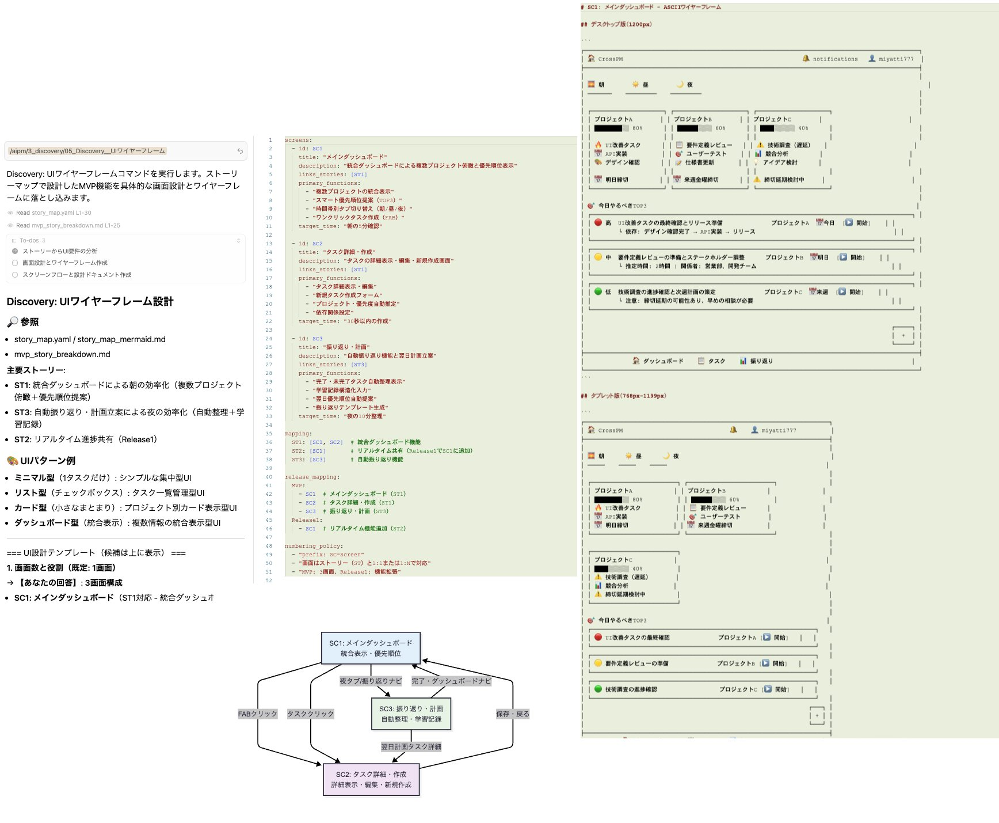

```
miyatti: /aipm/3_discovery/05_Discovery__UIワイヤーフレーム

AI: ストーリーマップで設計したMVP機能を具体的な画面設計とワイヤーフレームに落とし込みます。
    主要ストーリー:
    - ST1: 統合ダッシュボードによる朝の効率化（複数プロジェクト俯瞰＋優先順位提案）
    - ST3: 自動振り返り・計画立案による夜の効率化（自動整理＋学習記録）
    - ST2: リアルタイム進捗共有（Release1）

miyatti: OK

AI: ✅ UIワイヤーフレーム完了！
    📁 screen_map.yaml - 3画面構成とストーリー対応（SC1/SC2/SC3）
    📁 screen_flow.yaml - 画面遷移とナビゲーション構造
    📁 screen_flow_mermaid.md - 画面フローの視覚化図とユーザージャーニー
    📁 design/SC1_design.yaml - メインダッシュボードの詳細設計仕様
    📁 design/SC2_design.yaml - タスク詳細・作成画面の詳細設計仕様
    📁 design/SC3_design.yaml - 振り返り・計画画面の詳細設計仕様
    📁 design/SCx_wireframe_ascii.md - ASCII図（全デバイス対応）
    📁 ui_wireframe_summary.md - UI設計の総合サマリー
    
    🎯 設計された3つの画面:
    - SC1: メインダッシュボード (ST1対応) - 複数プロジェクト統合表示、スマート優先順位TOP3
    - SC2: タスク詳細・作成 (ST1対応) - タスク詳細表示・編集、新規作成、自動推定
    - SC3: 振り返り・計画 (ST3対応) - 自動実績サマリー、学習記録、翌日計画
```

#### **午後13:20 - Draw.ioスクリーン生成**

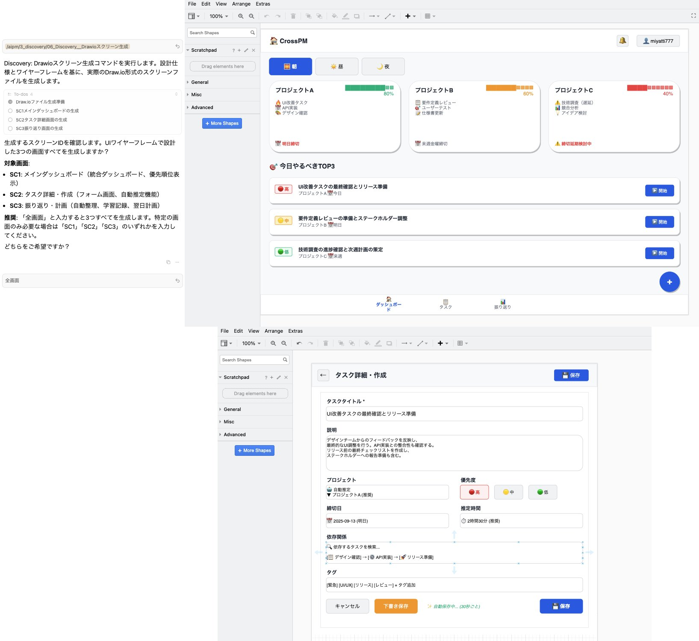

```
miyatti: /aipm/3_discovery/06_Discovery__Drawioスクリーン生成

AI: UIワイヤーフレームで設計した3つの画面すべてを生成しますか？

miyatti: 全画面

AI: ✅ Draw.ioスクリーン生成完了！
    📁 SC1_dashboard.drawio - メインダッシュボード（1200x800px）
    📁 SC2_task_detail.drawio - タスク詳細・作成画面（800x700px）
    📁 SC3_reflection.drawio - 振り返り・計画画面（1200x900px）
    📁 drawio_generation_summary.md
    
    🎨 特徴:
    - 統一されたデザインシステム: 一貫したカラーパレットとタイポグラフィ
    - 実用的なレイアウト: ユーザビリティを重視した配置
    - 編集可能: draw.io/diagrams.netで直接編集可能
    - エクスポート対応: PNG、SVG、PDF形式で出力可能
```

### 🛠️ Delivery フェーズ：「実際に動くものを作ろう」

#### **午後13:30 - 開発タスク分解**

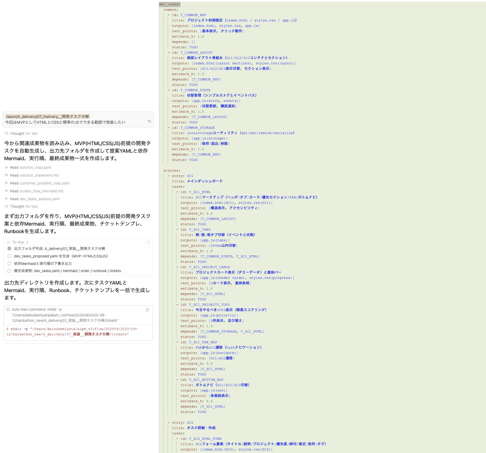


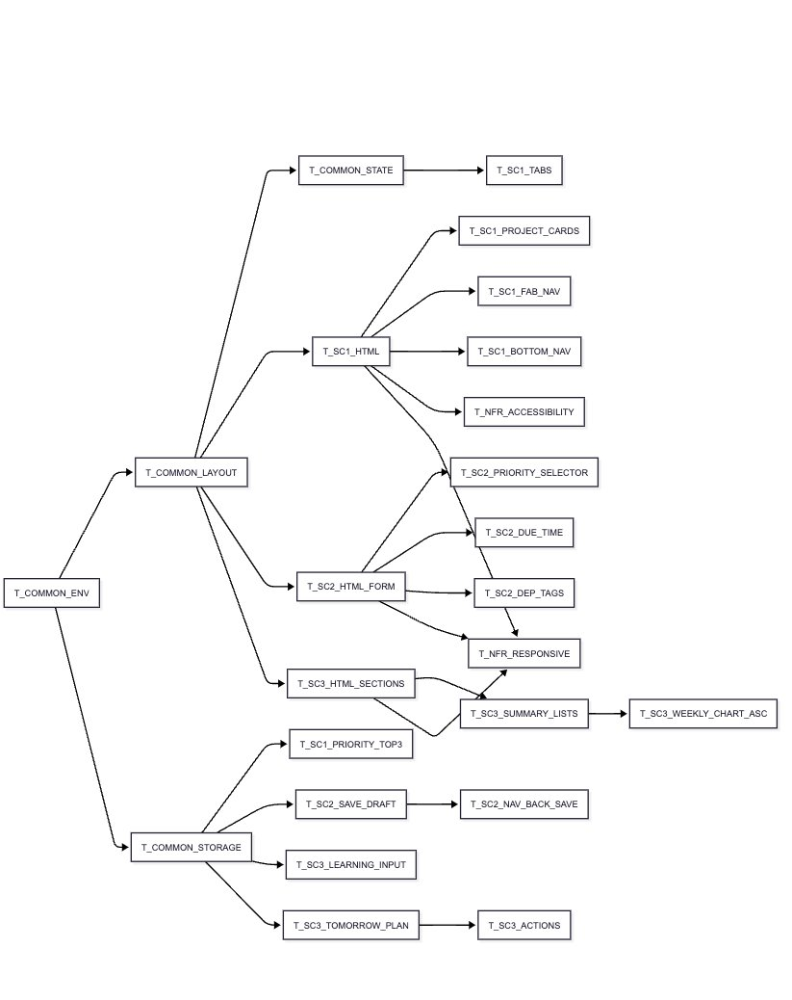


```
miyatti: /aipm/4_delivery/07_Delivery__開発タスク分解
miyatti: 今回はMVPとしてHTMLとCSSと標準のJSでできる範囲で実装したい

AI: これまでのDiscoveryフェーズの成果物を分析して開発スコープを推定します。
    推定開発スコープ:
    - 対象リリース: MVP（ST1 + ST3）を優先、Release1（ST2）は後回し
    - 優先ストーリー: ST1: 統合ダッシュボード（8 story points）、ST3: 自動振り返り（5 story points）
    - 技術スタック: HTML/CSS/Vanilla JS（React等は使わない）
    - 想定工数: 合計13 story points（約2-3週間相当）

miyatti: そのまま

AI: ✅ 開発タスク分解完了！
    📁 dev_tasks.yaml - 23個の開発タスク（status付き）
    📁 dev_tasks_mermaid.md - 依存関係の視覚化
    📁 dev_tasks_order.md - 推奨実行順
    📁 dev_runbook.md - LLM実装Runbook
    📁 tickets/TEMPLATE.md - チケットテンプレート
    
    🔧 タスク分類:
    - Common: T_COMMON_ENV, T_COMMON_LAYOUT, T_COMMON_STORAGE, T_COMMON_STATE
    - SC1関連: T_SC1_HTML, T_SC1_CSS, T_SC1_JS, T_SC1_INTEGRATION
    - SC2関連: T_SC2_HTML, T_SC2_CSS, T_SC2_JS, T_SC2_INTEGRATION
    - SC3関連: T_SC3_HTML, T_SC3_CSS, T_SC3_JS, T_SC3_INTEGRATION
    - 非機能: T_NFR_ACCESSIBILITY, T_NFR_RESPONSIVE, T_NFR_PERFORMANCE
```

#### **午後13:45 - チケット開始（T\_COMMON\_ENV）**


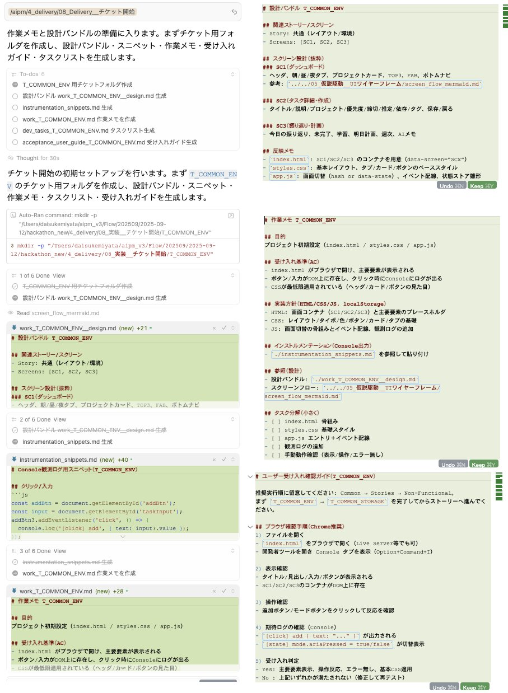

```
miyatti: /aipm/4_delivery/08_Delivery__チケット開始

AI: 推奨実行順: Common → Stories → Non-Functional
    まず T_COMMON_ENV → T_COMMON_STORAGE を完了してからストーリーに進んでください。

AI: ✅ T_COMMON_ENV のチケット開始セットを生成しました:
    📁 work_T_COMMON_ENV__design.md - 設計バンドル
    📁 instrumentation_snippets.md - Console観測ログ用スニペット
    📁 work_T_COMMON_ENV.md - 作業メモ
    📁 dev_tasks_T_COMMON_ENV.md - 実装タスクリスト
    📁 acceptance_user_guide_T_COMMON_ENV.md - ユーザー受け入れ確認ガイド
```

#### **午後13:50 - T\_COMMON\_ENV実装・検証**

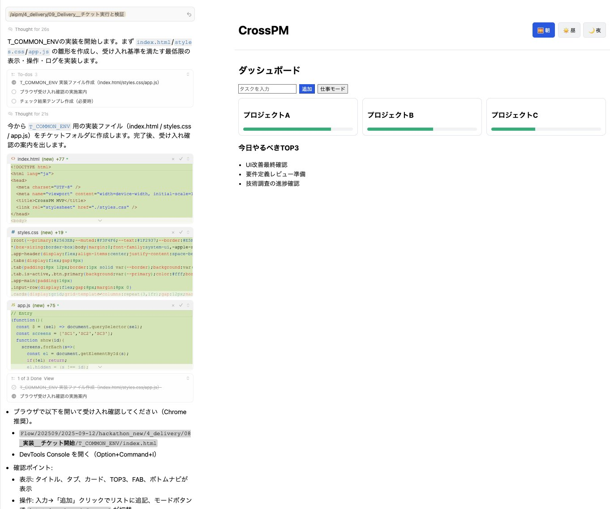

```
miyatti: /aipm/4_delivery/09_Delivery__チケット実行と検証

AI: T_COMMON_ENVの実装を開始します。
    index.html/styles.css/app.js の雛形を作成し、受け入れ基準を満たす最低限の表示・操作・ログを実装します。
    
    ✅ T_COMMON_ENV実装完了！
    📄 index.html - 基本HTML構造（header、main、footer、SC1/SC2/SC3セクション）
    🎨 styles.css - 基本スタイリング（レイアウト、タブ、カード、プログレスバー）
    ⚙️ app.js - 基本JavaScript（タスク追加、モード切替、タブ切替）
    
    確認ポイント:
    - 表示: タイトル、タブ、カード、TOP3、FAB、ボトムナビが表示
    - 操作: 入力→「追加」クリックでリストに追記、モードボタンで [state] mode.ariaPressed が切替
    - ログ: [click] add ...、[state] mode.ariaPressed = ...、[state] tasks.size が表示

miyatti: OK
```

#### **午後14:10 - チケット開始（T\_COMMON\_LAYOUT）**

```
miyatti: /aipm/4_delivery/08_Delivery__チケット開始

AI: ✅ T_COMMON_LAYOUT のチケット開始セットを生成しました:
    📁 work_T_COMMON_LAYOUT__design.md
    📁 instrumentation_snippets.md
    📁 work_T_COMMON_LAYOUT.md
    📁 dev_tasks_T_COMMON_LAYOUT.md
    📁 acceptance_user_guide_T_COMMON_LAYOUT.md
```

#### **午後14:15 - T\_COMMON\_LAYOUT実装・検証**

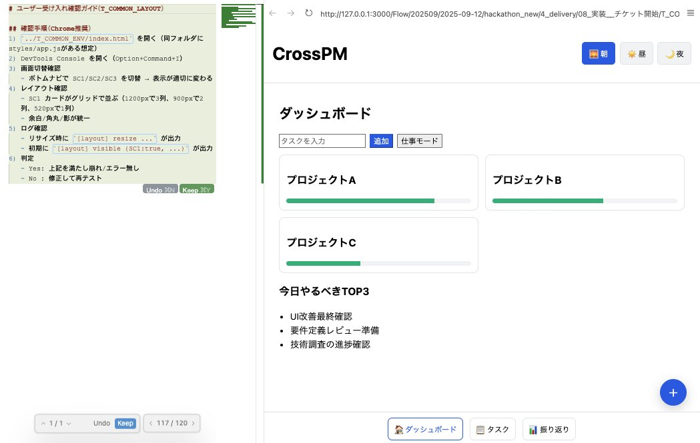

```
miyatti: /aipm/4_delivery/09_Delivery__チケット実行と検証

AI: T_COMMON_LAYOUTの実装を反映します。
    index.htmlに.containerを追加し、styles.cssに共通コンテナ/レスポンシブを追記、app.jsにレイアウト観測ログを組み込みます。
    
    ✅ 反映完了。変更点:
    - index.html: 各SC内に.containerラッパを追加
    - styles.css: .container定義とレスポンシブ余白を追加
    - app.js: [layout] visible と [layout] resize のログを追加
    
    確認手順（Chrome）:
    - ナビで SC1/SC2/SC3 を切り替え
    - Consoleに [layout] visible {SC1:true/false,...} が切替時に出力
    - リサイズで [layout] resize が出力されることを確認
```

#### **午後14:25 - 進捗レビュー・タスクリファイン**

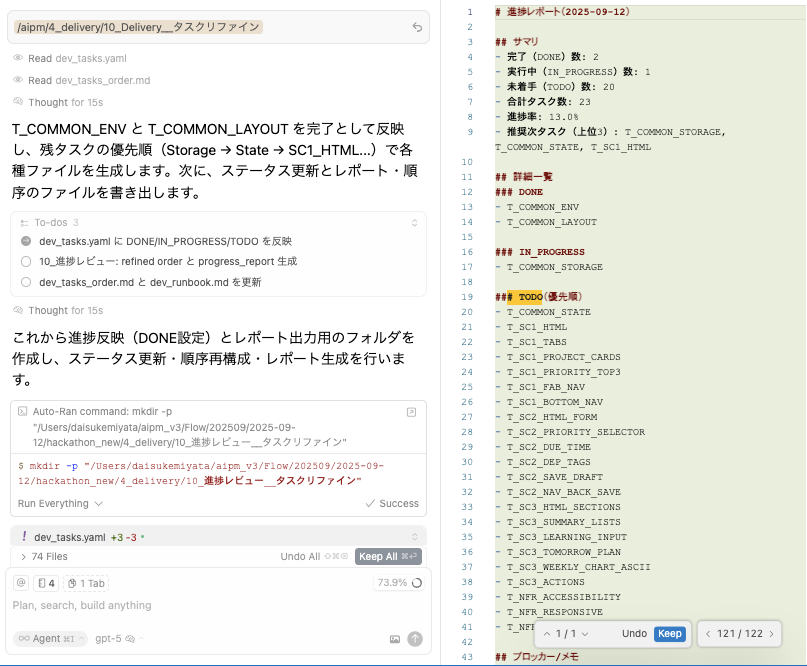

```
miyatti: /aipm/4_delivery/10_Delivery__タスクリファイン

AI: 現在の成果物を読み直し、進捗を可視化します。
    
    ✅ 進捗反映・リファイン完了:
    📁 dev_tasks.yaml: T_COMMON_ENV/T_COMMON_LAYOUT を DONE、T_COMMON_STORAGE を IN_PROGRESS に更新
    📁 progress_report.md: 進捗率 13.0%（DONE 2 / IN_PROGRESS 1 / TODO 20）
    📁 dev_tasks_order_refined.md: 残タスク順を再構成
    📁 dev_runbook.md: 現状優先度（Storage → State → SC1...）で更新
    
    次アクション（推奨順）:
    1) T_COMMON_STORAGE を完了
    2) T_COMMON_STATE
    3) T_SC1_HTML（SC1のマークアップ着手）
```

#### **午後14:35 - チケット開始（T\_COMMON\_STORAGE）**

```
miyatti: /aipm/4_delivery/08_Delivery__チケット開始

AI: ✅ T_COMMON_STORAGE のチケット開始セットを生成しました:
    📁 work_T_COMMON_STORAGE__design.md
    📁 instrumentation_snippets.md
    📁 work_T_COMMON_STORAGE.md
    📁 dev_tasks_T_COMMON_STORAGE.md
    📁 acceptance_user_guide_T_COMMON_STORAGE.md
```

#### **午後14:40 - T\_COMMON\_STORAGE実装・検証**

```
miyatti: /aipm_hackathon/09_実装__チケット実行と検証

AI: T_COMMON_STORAGEを実装します。
    app.jsにStorageUtilを追加し、保存/初期ロード処理を置換します。
    
    ✅ StorageUtilを実装して保存/復元に置換しました。
    確認手順（Chrome）:
    - index.html を開く → Console表示
    - 入力→「追加」→リストに反映、Consoleに [storage] saved { size: N }
    - ページ再読込後もリストが復元される
```

#### **午後14:55 - チケット開始（T\_COMMON\_STATE）**

```
miyatti: /aipm_hackathon/08_実装__チケット開始

AI: 実行する task_id を指定してください（推奨: T_COMMON_STATE）

miyatti: OK

AI: ✅ T_COMMON_STATE のチケット開始セットを作成しました。
    実装に進めますか？（createStore/EventBusの実装とタブ連動、ログ出力）
```

#### **午後15:00 - T\_COMMON\_STATE実装・検証**

```
miyatti: /aipm/4_delivery/09_Delivery__チケット実行と検証

AI: T_COMMON_STATE を実装します。
    app.js に createStore と EventBus を追加し、タブ切替と追加時のイベント発火、状態変更ログを組み込みます。
    
    ✅ createStore/EventBusを実装し、タブ切替で Store.set({mode})、追加時に EventBus.emit('task:added', ...) を組み込みました。
    確認手順（Chrome）:
    - index.html を開く → Console表示
    - タブを切替して [state] changed { mode: ... } が出る
    - 入力→追加で [event] task:added { text: ... } とリスト反映

miyatti: State changed はでてないようです

AI: ✅ ログ出力を修正しました！
    追加対応:
    - 初期化直後に Store.set({ tasks: bootTasks }) を必ず実行し、[state] changed を一度出すように変更
    - タブクリック時に明示ログを追加（[ui] tab click morning/noon/night）
    
    動作確認（Chrome Console）:
    - タブを押下すると [ui] tab click xxx → 続いて [state] changed { mode: 'xxx', tasks: [...] } が出力される
    - 初回ロード時に [state] store_ready のあとに [state] changed { ... } が一度出力される
```

**合計実装時間**: 約2時間30分（基本機能完成）

### 🎉 結果：1日でプロダクト完成

```
最終成果物:
📊 詳細な市場調査レポート
👤 具体的なペルソナ（田中健太さん）
📱 3画面のUIワイヤーフレーム  
💻 実際に動くWebアプリ
📈 ビジネス計画（年間18億円市場）
```


## 📋 全コマンド一覧と使い方

### 🎬 0. 初期化フェーズ

| コマンド | 目的 | いつ使う？ |
| --- | --- | --- |
| `/aipm/0_initialize/00_プロジェクト開始` | プロジェクトの初期化とフォルダ構造作成 | 🚀 **最初に必ず実行** - 新しいアイデアを形にしたいとき |

### 🔍 1. Senseフェーズ（情報収集・発散）

| コマンド | 目的 | いつ使う？ |
| --- | --- | --- |
| `/aipm/1_sense/01_競合調査` | Web検索ベースの競合分析・比較マトリクス作成 | 💡 「どんな競合がいるんだろう？」「差別化ポイントは？」 |
| `/aipm/1_sense/02_顧客調査` | ターゲットユーザーのニーズ・課題調査 | 👥 「ユーザーは何に困ってる？」「本当にニーズある？」 |
| `/aipm/1_sense/03_インタビュー設計` | UXリサーチ用インタビューガイド作成 | 🎤 「実際にユーザーの声を聞きたい」「何を質問すればいい？」 |
| `/aipm/1_sense/04_リクルーティング計画` | インタビュー対象者の募集計画 | 📢 「どうやってインタビュー相手を見つける？」 |
| `/aipm/1_sense/05_インタビュー分析（個別）` | 1件のインタビュー結果を構造化して分析 | 📝 「インタビューしたけど、どう整理すればいい？」 |
| `/aipm/1_sense/06_リサーチサマリー（全体）` | 複数の調査結果を統合・洞察抽出 | 🔗 「調査結果をまとめて、全体像を把握したい」 |
| `/aipm/1_sense/07_オポチュニティ仮説抽出` | 機会仮説の構造化リスト作成 | 💎 「調査結果から、どんなチャンスが見える？」 |
| `/aipm/1_sense/90_仮想インタビューログ生成` | 発散用のシミュレーションインタビュー | 🎭 「実際のインタビュー前に、パターンを想定したい」 |

### 🎯 2. Focusフェーズ（収束・戦略決定）

| コマンド | 目的 | いつ使う？ |
| --- | --- | --- |
| `/aipm/2_focus/01_プロダクト定義` | Mission/Vision/Value・ポジションステートメント作成 | 🚀 「何を作るか、なぜ作るかを明確にしたい」 |
| `/aipm/2_focus/02_市場規模推定` | TAM/SAM/SOM計算・Google Sheets連携 | 📈 「どのくらい売れる？市場性はある？」 |
| `/aipm/2_focus/03_ラフロードマップ作成` | 四半期/週粒度の開発スケジュール | 📅 「いつまでに何を作る？大まかなスケジュールは？」 |
| `/aipm/2_focus/04_OKR作成` | 目標と成果指標の設定 | 🎯 「成功をどう測る？具体的な目標は？」 |
| `/aipm/2_focus/05_リーンキャンバス作成` | ビジネスモデルの統合整理 | 🗺️ 「ビジネス全体を1枚で整理したい」 |

### 🔬 3. Discoveryフェーズ（仮説駆動設計）

| コマンド | 目的 | いつ使う？ |
| --- | --- | --- |
| `/aipm/3_discovery/01_ペルソナ作成` | ターゲットユーザーの具体化・体験マップ | 👤 「具体的にどんな人が使う？どんな1日を過ごしてる？」 |
| `/aipm/3_discovery/02_課題定義` | フェーズ別の問題分析と構造化 | 😤 「ユーザーのどの場面で、どんな問題が起きてる？」 |
| `/aipm/3_discovery/03_ソリューションマップ` | 課題に対する解決策設計・MVP優先順位 | 💡 「課題をどう解決する？何から作る？」 |
| `/aipm/3_discovery/04_ストーリーマップ` | ユーザーストーリーと受け入れ基準・開発計画 | 📖 「機能を開発可能な単位に分解したい」 |
| `/aipm/3_discovery/05_UIワイヤーフレーム` | 画面設計・レスポンシブ対応・アクセシビリティ | 🎨 「どんな画面？どう操作する？」 |
| `/aipm/3_discovery/06_Drawioスクリーン生成` | Draw.io形式の詳細設計図・編集可能ワイヤー | 📐 「きれいな設計図が欲しい」「チームで共有したい」 |

### 🛠️ 4. Deliveryフェーズ（実装・検証）

| コマンド | 目的 | いつ使う？ |
| --- | --- | --- |
| `/aipm/4_delivery/07_開発タスク分解` | 実装タスクの細分化・依存関係・工数見積もり | 🔧 「実際に作るには何をすればいい？どのくらいかかる？」 |
| `/aipm/4_delivery/08_チケット開始` | 個別タスクの作業環境準備・設計資料整理 | 📋 「この機能を実装したい」「何から手をつける？」 |
| `/aipm/4_delivery/09_チケット実行と検証` | 実装支援・受け入れテスト・動作確認 | ✅ 「実際にコードを書いて、動くかテストしたい」 |
| `/aipm/4_delivery/10_タスクリファイン` | 進捗レビュー・タスク再構成・優先順位調整 | 📊 「今どのくらい進んだ？次に何をする？」 |

### 🔄 5. Sense2フェーズ（検証・改善）

| コマンド | 目的 | いつ使う？ |
| --- | --- | --- |
| `/aipm/5_sense2/00_プロダクトメトリクス` | 成果指標の設計・測定方法定義 | 📊 「作ったアプリの効果をどう測る？」 |
| `/aipm/5_sense2/01_インタビュー設計` | 検証用インタビューガイド作成 | 🔍 「実際に使ってもらって、感想を聞きたい」 |
| `/aipm/5_sense2/02_インタビュー分析（個別）` | ユーザーフィードバックの個別分析 | 📝 「ユーザーの反応をちゃんと分析したい」 |
| `/aipm/5_sense2/03_リサーチサマリー（全体）` | 検証結果の統合・改善点抽出 | 🔗 「フィードバックから何がわかった？次の改善は？」 |
| `/aipm/5_sense2/04_オポチュニティ仮説抽出` | 新たな機会の発見・次期機能検討 | 💎 「次に何を作ればいい？新しいチャンスは？」 |

### 🎯 6. Focus2フェーズ（本格展開計画）

| コマンド | 目的 | いつ使う？ |
| --- | --- | --- |
| `/aipm/6_focus2/01_ロードマップ設計` | 詳細な開発ロードマップ・マイルストーン | 📅 「本格的なスケジュールを立てたい」 |
| `/aipm/6_focus2/02_WBS作成` | 作業分解構造・プロジェクト管理 | 📊 「プロジェクト全体を体系的に管理したい」 |
| `/aipm/6_focus2/03_リスク分析` | リスク識別・対策・監視計画 | ⚠️ 「何が失敗要因？どう対策する？」 |

### 📖 7. Discovery2フェーズ（詳細設計）

| コマンド | 目的 | いつ使う？ |
| --- | --- | --- |
| `/aipm/7_discovery2/01_PRD作成` | プロダクト要求仕様書・詳細機能定義 | 📋 「開発チームに渡す詳細な仕様書が欲しい」 |
| `/aipm/7_discovery2/02_DesignDoc作成` | 技術設計書・アーキテクチャ | 🏗️ 「システムの技術的な設計を整理したい」 |

### 🚀 8. Delivery2フェーズ（本格開発）

| コマンド | 目的 | いつ使う？ |
| --- | --- | --- |
| `/aipm/8_delivery2/01_バックログ初期化` | 開発バックログ・スプリント計画 | 📋 「アジャイル開発を始めたい」 |
| `/aipm/8_delivery2/02_スプリントゴール` | スプリント目標・成果定義 | 🎯 「今回のスプリントで何を達成する？」 |
| `/aipm/8_delivery2/03_スプリントレビュー` | スプリント振り返り・改善点抽出 | 🔄 「スプリントの成果と課題をまとめたい」 |
| `/aipm/8_delivery2/04_開発環境セットアップ` | 開発環境・ツール準備 | ⚙️ 「開発を始める環境を整えたい」 |
| `/aipm/8_delivery2/05_開発計画作成` | 詳細な開発計画・リソース配分 | 📊 「誰がいつまでに何を作る？」 |
| `/aipm/8_delivery2/06_実装順序計画` | 機能実装の順序・依存関係 | 🔗 「どの順番で機能を作ればいい？」 |
| `/aipm/8_delivery2/07_ストーリー実装` | 個別ストーリーの実装支援 | 💻 「この機能を実際に作りたい」 |
| `/aipm/8_delivery2/08_記事執筆` | 技術記事・ドキュメント作成 | 📝 「作ったものを記事にして共有したい」 |
| `/aipm/8_delivery2/09_成果物確認` | 最終成果物の品質確認・テスト | ✅ 「全部完成した？品質は大丈夫？」 |

### 🏆 9. Hackathonフェーズ（発表・提出）

| コマンド | 目的 | いつ使う？ |
| --- | --- | --- |
| `/aipm/9_hackathon/Marpスライド生成` | プレゼンテーション資料作成 | 📊 「発表用のスライドを作りたい」 |
| `/aipm/9_hackathon/成果物パッケージング` | 成果物の整理・提出準備 | 📦 「作ったものをきれいにまとめたい」 |
| `/aipm/9_hackathon/GitHub提出` | GitHubリポジトリ作成・公開 | 🌐 「GitHubで世界に公開したい」 |


## 🎯 フェーズ別の使い分け

### 🤔 「何を作るか決まってない」→ **Senseフェーズ**

```
/aipm/1_sense/01_競合調査     # まず市場を知る
/aipm/1_sense/02_顧客調査     # ユーザーを理解する
/aipm/1_sense/07_オポチュニティ仮説抽出  # チャンスを見つける
```

### 💡 「アイデアはある、具体化したい」→ **Focusフェーズ**

```
/aipm/2_focus/01_プロダクト定義      # 何を作るか明確に
/aipm/2_focus/02_市場規模推定        # 売れるかどうか確認
/aipm/2_focus/05_リーンキャンバス作成 # ビジネスモデル整理
```

### 🎨 「作るものは決まった、設計したい」→ **Discoveryフェーズ**

```
/aipm/3_discovery/01_ペルソナ作成        # 誰のために作る？
/aipm/3_discovery/04_ストーリーマップ    # どんな機能？
/aipm/3_discovery/05_UIワイヤーフレーム  # どんな画面？
```

### 💻 「設計完了、実際に作りたい」→ **Deliveryフェーズ**

```
/aipm/4_delivery/07_開発タスク分解       # 作業を分割
/aipm/4_delivery/08_チケット開始         # 1つずつ実装
/aipm/4_delivery/09_チケット実行と検証   # 動作確認
```

### 🏆 「完成した、発表・公開したい」→ **Hackathonフェーズ**

```
/aipm/9_hackathon/Marpスライド生成      # プレゼン資料
/aipm/9_hackathon/成果物パッケージング  # きれいに整理
/aipm/9_hackathon/GitHub提出           # 世界に公開
```

## 💡 迷ったときのコマンド選び

### 状況別おすすめコマンド

#### 😵 「何から始めればいいかわからない」

→ `/aipm/0_initialize/00_プロジェクト開始` で環境準備  
→ `/aipm/1_sense/01_競合調査` で市場を知る

#### 🤷 「アイデアはあるけど、需要があるかわからない」

→ `/aipm/1_sense/02_顧客調査` でユーザーニーズ確認  
→ `/aipm/2_focus/02_市場規模推定` で市場性検証

#### 🎨 「機能は決まったけど、どんな画面にすればいい？」

→ `/aipm/3_discovery/01_ペルソナ作成` でユーザー像明確化  
→ `/aipm/3_discovery/05_UIワイヤーフレーム` で画面設計

#### 💻 「設計はできた、実際に作りたい」

→ `/aipm/4_delivery/07_開発タスク分解` で作業計画  
→ `/aipm/4_delivery/08_チケット開始` で実装開始

#### 🏆 「完成した、みんなに見せたい」

→ `/aipm/9_hackathon/Marpスライド生成` でプレゼン準備  
→ `/aipm/9_hackathon/GitHub提出` で世界に公開

#### 🏃 「ハッカソンで時間がない！」→ **高速開発パターン**

```
/aipm/3_discovery/01_ペルソナ作成       # 15分でユーザー像確定
/aipm/3_discovery/02_課題定義          # 20分で問題を深掘り
/aipm/3_discovery/03_ソリューションマップ # 25分で解決策設計
/aipm/3_discovery/04_ストーリーマップ   # 30分で機能具体化
/aipm/4_delivery/07_開発タスク分解     # 20分で実装計画
/aipm/4_delivery/08_チケット開始       # タスク別実装準備
/aipm/4_delivery/09_チケット実行と検証  # 実装・動作確認
/aipm/9_hackathon/Marpスライド生成     # 発表資料自動生成
/aipm/9_hackathon/成果物パッケージング  # 提出物整理
/aipm/9_hackathon/GitHub提出          # GitHub公開・PR作成
```

**特徴**: 市場調査（Sense）・戦略決定（Focus）をスキップして、設計（Discovery）→実装（Delivery）→発表・提出に集中

## 🤔 よくある質問

### Q. プログラミングできなくても大丈夫？

**A.** 大丈夫です！AIが全部やってくれます。あなたは「こんなアプリが欲しい」というアイデアがあれば十分です。

### Q. ビジネスの知識がないんですが...

**A.** 問題ありません！競合調査、市場分析、ペルソナ作成...全てAIが質問しながら一緒に作ってくれます。

### Q. 何から始めればいいかわからない

**A.** 「\*\*/**」を押して「**プロジェクト開始\*\*」を選ぶだけ。あとはAIが順番に案内してくれます。

### Q. 途中で詰まったらどうする？

**A.** 「**おまかせ**」と言えばAIが最適な提案をしてくれます。実際の事例でも、ほとんど「おまかせ」で進んでいます。

### Q. 本当に1日で作れるの？

**A.** 上記のCrossPM事例が実証済みです。アイデアの複雑さにもよりますが、簡単なアプリなら半日、しっかりしたものでも1日で形になります。

### Q. 作ったものはどこに保存される？

**A.** `Flow/日付/`フォルダにドラフトが作られ、完成したら`Stock/`フォルダに整理されます。全部自動です。

### Q. 以前の「トリガーワード（Rules）」は使えますか？

**A.** 互換はありますが、安定実行と発見性のため **Commandsの使用を推奨** します（`/` 起点で確実に実行）。

## FAQ

## 📜 ライセンス

MIT License - 自由に使って、改良して、シェアしてください！